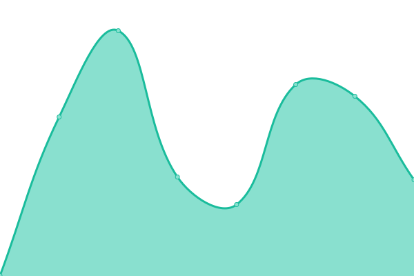

# [📈 Live Status](https://upptime.github.io/upptime): <!--live status--> **🟧 Partial outage**

This repository contains the open-source uptime monitor and status page for [Upptime](https://upptime.js.org), powered by [Upptime](https://github.com/upptime/upptime).

With [Upptime](https://upptime.js.org), you can get your own unlimited and free uptime monitor and status page, powered entirely by a GitHub repository. We use [Issues](https://github.com/upptime/upptime/issues) as incident reports, [Actions](https://github.com/w8896699/upptime-test/actions) as uptime monitors, and [Pages](https://upptime.github.io/upptime) for the status page.

<!--start: status pages-->
<!-- This summary is generated by Upptime (https://github.com/upptime/upptime) -->
<!-- Do not edit this manually, your changes will be overwritten -->
<!-- prettier-ignore -->
| URL | Status | History | Response Time | Uptime |
| --- | ------ | ------- | ------------- | ------ |
|  [Rocket chat](https://chat.developer.gov.bc.ca/api/info) | 🟩 Up | [rocket-chat.yml](https://github.com/w8896699/upptime-test/commits/HEAD/history/rocket-chat.yml) | 

 669ms
     
 | 

<a href="https://w8896699.github.io/upptime-test/history/rocket-chat">100.00%</a>
    

|  [Registry](https://registry.developer.gov.bc.ca) | 🟩 Up | [registry.yml](https://github.com/w8896699/upptime-test/commits/HEAD/history/registry.yml) | 

 606ms
     
 | 

<a href="https://w8896699.github.io/upptime-test/history/registry">100.00%</a>
    

|  [Silver Cluster](https://api.silver.devops.gov.bc.ca:6443/readyz) | 🟩 Up | [silver-cluster.yml](https://github.com/w8896699/upptime-test/commits/HEAD/history/silver-cluster.yml) | 

 305ms
     
 | 

<a href="https://w8896699.github.io/upptime-test/history/silver-cluster">100.00%</a>
    

|  [Test Broken Site](https://thissitedoesnotexist.koj.co) | 🟥 Down | [test-broken-site.yml](https://github.com/w8896699/upptime-test/commits/HEAD/history/test-broken-site.yml) | 

 0ms
     
 | 

<a href="https://w8896699.github.io/upptime-test/history/test-broken-site">100.00%</a>
    

<!--end: status pages-->

[**Visit our status website →**](https://upptime.github.io/upptime)

## 📄 License

- Powered by: [Upptime](https://github.com/upptime/upptime)
- Code: [MIT](./LICENSE) © [Anand Chowdhary](https://anandchowdhary.com), supported by [Pabio](https://pabio.com)
- Data in the `./history` directory: [Open Database License](https://opendatacommons.org/licenses/odbl/1-0/)
